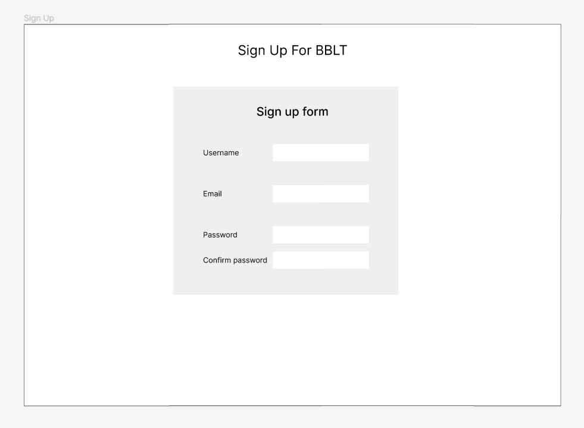
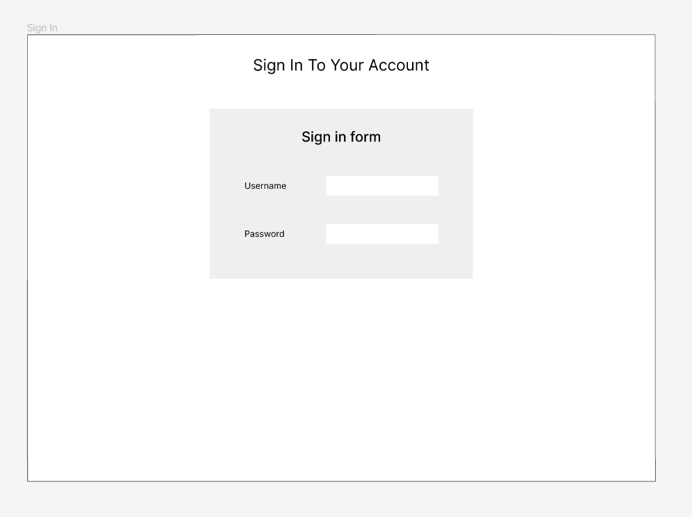
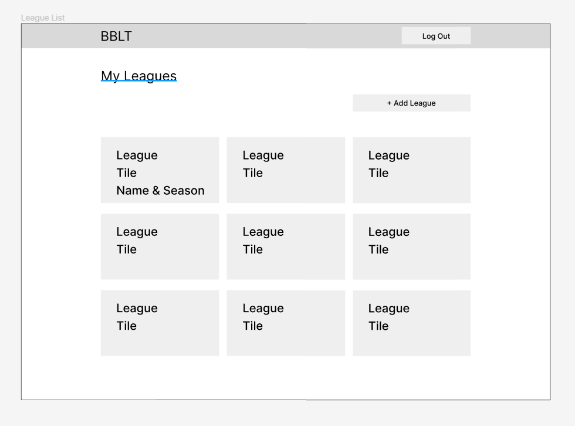
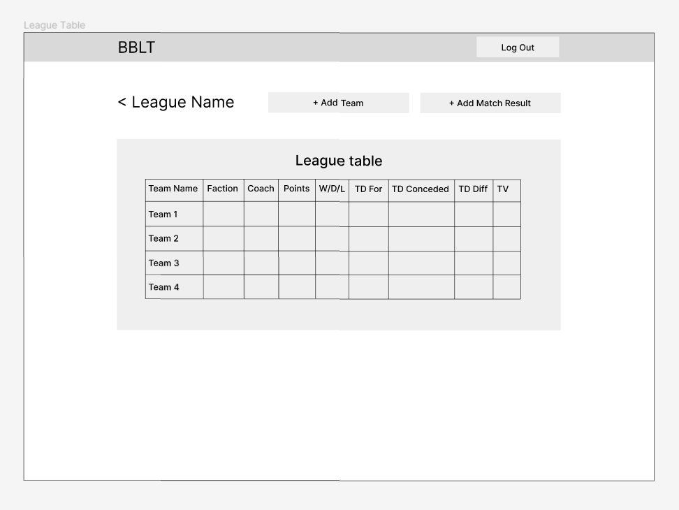
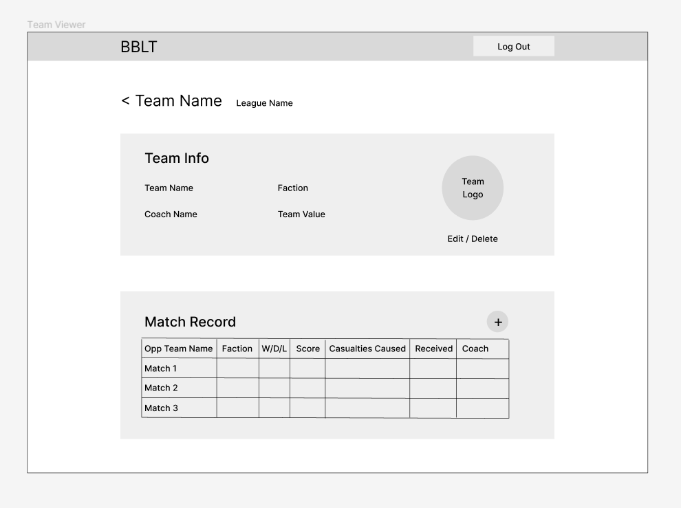
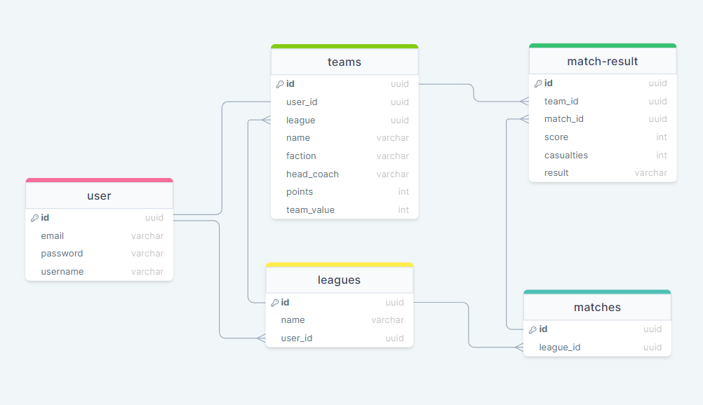

# Project Title

Blood Bowl League Tracker

## Overview

A league tracker for the board game "Blood Bowl" made by Games Workshop.

Similar to sports in real life, matches are played between 2 players from a pool of players called a league. This app is going to make it easier for the person running the Blood Bowl league to keep track of which teams are in which leagues and the results of all the matches between the players in the league.

### Problem

Keeping accurate records of match statistics (scores, casualties, etc) is cumbersome and not easily done. Setting up your own individual league tracker requires a lot of time and effort

### User Profile

League commissioner: the person organising a league and tracking the match results.
Coach (nice to have): the person playing games of Blood Bowl with one of the teams in the league.

### Features

- Sign up/ login
- League creator
- League table view
- CRUD teams
- CRUD leagues
- CRUD matches

#### League Commissioners:

As a league commissioner, I want to:

- sign up for the app and create an account, providing necessary information such as username, email, and password.
- login and logout.
- be able to create new leagues, specifying league name.
- be able to edit and delete a league.
- be able to start a new season in an existing league.
- view league tables for my leagues showing; team rankings, W/D/L record, bonus points scored, total casualties and TDs (scored, conceded and differential)
- view the league table for past seasons.
- add teams specifying team name, coach name and team race
- be able to enter match results (scores and casualties caused by each team).
- be able to edit and delete match results.

#### Coach (Nice to have):

As a coach, I want to:

- sign up for the app and create an account, providing necessary information such as username, email, and password.
- browse available leagues and apply to join one, submitting my team details for review by the league commissioner.
- view the league(s) I am currently participating in, including standings, upcoming matches, and league announcements.
- submit match results for games played against other teams in the league, providing details such as score, touchdowns, and casualties.
- be able to view past match results and team statistics for myself and other teams in the league.

## Implementation

### Tech Stack

- HTML
- CSS
- JavaScript
- React
- Express
- MySQL
- Knex

### APIs

FUMBBL: https://fumbbl.com/apidoc/FUMBBL

### Sitemap

- Sign up: Page for new users to sign up to the app.
- Login: Page for users to login to the app.
- My Leagues (this is the homepage): Page with the full list of the leagues a user has created.
- League Table: Page that shows the league table for a selected league. The table will show each team in that league with their league points and match statistics.
- Team View: Page to show a focused view of a single team, including match history and teams details such as name, faction and head coach (the person playing that team).

### Mockups

Sign up:

Login page:

My Leagues:

League Table:

Team Details:

### Data

Below shows the relationships between databases:

### Endpoints

#### Post /leagues

#### GET /leagues

- Returns an array of league objects
- Contains only enough information to display in the league list
- Response example:
  [
  {
  "id": "84e96018-4022-434e-80bf-000ce4cd12b8",
  "name": "Lustrian Super League",
  "user-id": "191de346-b3c2-47b4-bf5b-6db90d1e3bdc",
  "teams": "8"
  },
  {
  "id": "2d818087-c1f4-4ec2-bcdc-b545fd6ec258",
  "name": "Halfling Thimble Cup",
  "user_id": "76ca28c0-7dea-4553-887f-8e5129a80fc3",
  "teams": "14"
  }
  ]

#### GET /leagues/:id

- `:id` must be swapped out with the id of a league in the list of leagues
- Returns a detailed object of a single league including match stats for each team in that league
- Response example:
  {
  "id": "84e96018-4022-434e-80bf-000ce4cd12b8",
  "name": "Lustrian Super League",
  "teams": [
  {
  "id": "894b2ef9-640e-4d55-95ac-c65cfc39d693",
  "name": "Gwakamoli Crater Gators",
  "faction": "Lizardmen",
  "points": "12",
  "head_coach": "Bob Bifford"
  "wins": "3",
  "draws": "1",
  "losses": "0",
  "TDFor": "8",
  "TDAgainst": "3",
  "casualties": "10",
  "teamValue": "1220"
  },
  {
  "id": "6ff4314c-acde-4c91-a753-95cb7a366ee9",
  "name": "Greenfield Grasshuggers",
  "faction": "Halflings",
  "points": "2",
  "head_coach": "Jim Jampire"
  "wins": "0",
  "draws": "1",
  "losses": "3",
  "TDFor": "6",
  "TDAgainst": "10",
  "casualties": "2",
  "teamValue": "950"
  }
  ]
  }

#### PUT /leagues/:id

#### DELETE /leagues/:id

#### POST /teams

#### GET /teams/:id

#### PUT /teams/:id

#### DELETE /teams/:id

#### POST /matches

#### GET /matches

#### PUT /matches/:id

#### DELETE /matches/:id

### Auth

I'm planning for having user accounts which will require them to sign up and login/logout, but we havne't learnt about that yet.

## Roadmap

Scope your project as a sprint. Break down the tasks that will need to be completed and map out timeframes for implementation. Think about what you can reasonably complete before the due date. The more detail you provide, the easier it will be to build.

- Set up databases
- Create seed data
- Build endpoints
  - See endpoints above
- Build header
- Build footer
- Build my leagues page
  - Subheader
  - League cards
  - Add league modal
  - Edit/delete league modal
- Build league table page
  - Subheader
  - League table
  - Add match result modal
  - Add team modal
- Team details page
  - Subheader
  - Team details
  - Match record
  - Edit/delete team details modal
  - Add match result modal
  - Edit/delete match result modal
- Build sign up page
  - Subheader
  - Form
  - Validation
- Build login page
  - Subheader
  - Form
  - Validation
- User authentication
  - TBD
- Build user settings page
  - TBD

## Nice-to-haves

- Sort league table
- Add logos to teams. Placeholder based on team race, but can be custom.
- League settings: league point values, what bonus points are available, etc.
- User settings: allow users to change their username and password.
- Coach users - see 'User Profile' and 'Features' above.
- Comissioners to be able to:
  - view all players registered in each of their leagues and manage their memberships, including adding, removing, approving and changing the status (active/inactive) of players.
  - review and approve match results submitted by players, ensuring they comply with league rules.
